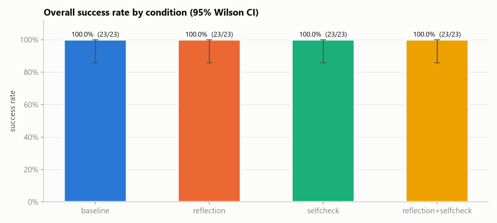
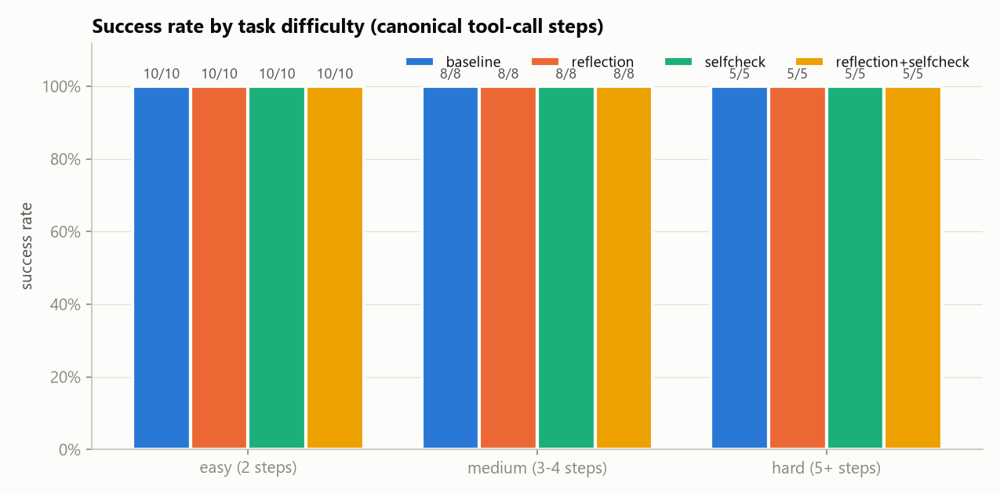
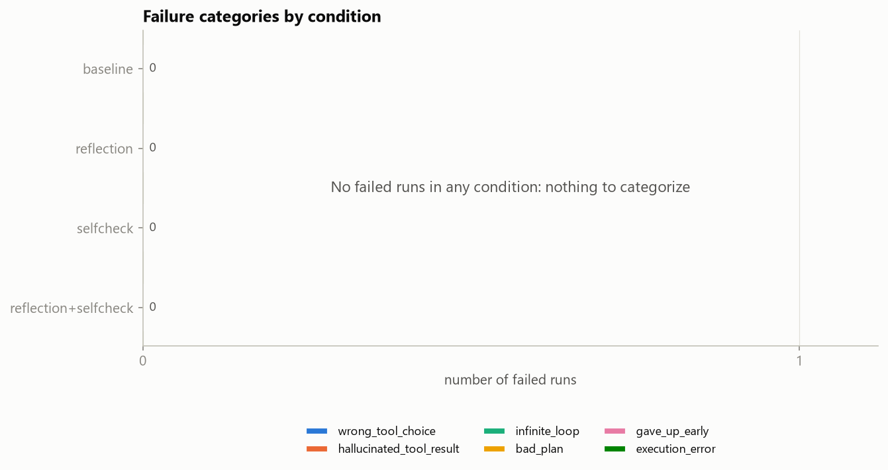
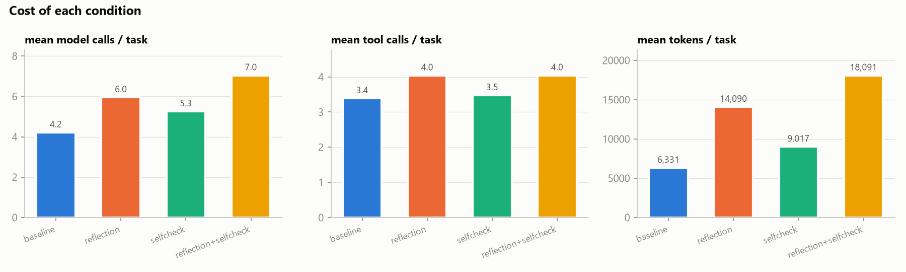
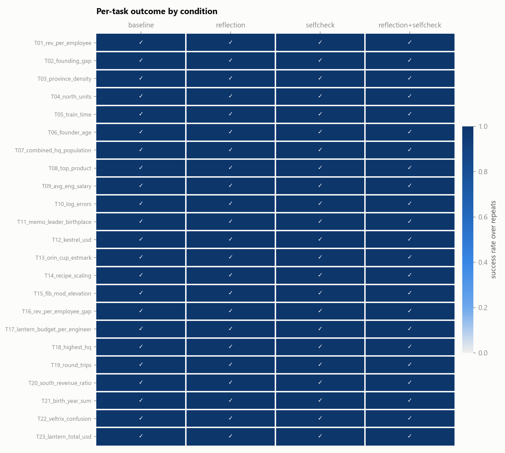

# Agent reliability report

- Model(s): gemma-4-31b-it
- Tasks: 23
- Run directories: gemma_baseline, gemma_selfcheck, gemma_reflection, gemma_reflection+selfcheck
- Every number below was computed from the run traces. Runs that ended in `api_error` are excluded from success rates and counted separately.

## Overall success

| condition | scored runs | correct | success | 95% CI | api_error (excluded) |
|---|---|---|---|---|---|
| baseline | 23 | 23 | 100.0% | 85.7% – 100.0% | 0 |
| reflection | 23 | 23 | 100.0% | 85.7% – 100.0% | 0 |
| selfcheck | 23 | 23 | 100.0% | 85.7% – 100.0% | 0 |
| reflection+selfcheck | 23 | 23 | 100.0% | 85.7% – 100.0% | 0 |

## Success by difficulty

| difficulty | baseline | reflection | selfcheck | reflection+selfcheck |
|---|---|---|---|---|
| easy (2 steps) | 100.0% (10/10) | 100.0% (10/10) | 100.0% (10/10) | 100.0% (10/10) |
| medium (3-4 steps) | 100.0% (8/8) | 100.0% (8/8) | 100.0% (8/8) | 100.0% (8/8) |
| hard (5+ steps) | 100.0% (5/5) | 100.0% (5/5) | 100.0% (5/5) | 100.0% (5/5) |

## Failure categories

Final category = manual label when present, otherwise the heuristic label.

| category | baseline | reflection | selfcheck | reflection+selfcheck |
|---|---|---|---|---|
| wrong_tool_choice | 0 | 0 | 0 | 0 |
| hallucinated_tool_result | 0 | 0 | 0 | 0 |
| infinite_loop | 0 | 0 | 0 | 0 |
| bad_plan | 0 | 0 | 0 | 0 |
| gave_up_early | 0 | 0 | 0 | 0 |
| execution_error | 0 | 0 | 0 | 0 |

_No manual labels yet. Categories are heuristic only (run `label` to review them)._

## Interventions vs baseline

Paired by task (majority outcome over repeats). *fixed* = baseline wrong → intervention right; *broken* = the reverse. p = exact McNemar test on fixed vs broken. With this few tasks, treat p > 0.05 as "no detectable effect", not as evidence of no effect.

| condition | paired tasks | baseline | condition | Δ | fixed | broken | McNemar p |
|---|---|---|---|---|---|---|---|
| reflection | 23 | 100.0% | 100.0% | +0.0 pp | 0 | 0 | 1.000 |
| selfcheck | 23 | 100.0% | 100.0% | +0.0 pp | 0 | 0 | 1.000 |
| reflection+selfcheck | 23 | 100.0% | 100.0% | +0.0 pp | 0 | 0 | 1.000 |

- **reflection**: fixed —; broken —
- **selfcheck**: fixed —; broken —
- **reflection+selfcheck**: fixed —; broken —

## Cost and intervention delivery

*self-checks answered* = self-check prompts the model responded to, out of prompts sent. If it's below the total, the model silently skipped verification (empty reply), and that condition does not really test self-check. *seconds* includes rate-limit and retry waits.

| condition | model calls | tool calls | tool errors | tokens | seconds | API retries (total) | empty responses | self-checks answered |
|---|---|---|---|---|---|---|---|---|
| baseline | 4.2 | 3.4 | 0.00 | 6,331 | 119.0 | 11 | 0 | 0/0 |
| reflection | 6.0 | 4.0 | 0.26 | 14,090 | 211.6 | 28 | 0 | 0/0 |
| selfcheck | 5.3 | 3.5 | 0.00 | 9,017 | 205.2 | 77 | 0 | 22/22 |
| reflection+selfcheck | 7.0 | 4.0 | 0.22 | 18,091 | 272.2 | 91 | 0 | 23/23 |

## Per-task outcomes

| task | steps | baseline | reflection | selfcheck | reflection+selfcheck |
|---|---|---|---|---|---|
| T01_rev_per_employee | 2 | 1/1 | 1/1 | 1/1 | 1/1 |
| T02_founding_gap | 2 | 1/1 | 1/1 | 1/1 | 1/1 |
| T03_province_density | 2 | 1/1 | 1/1 | 1/1 | 1/1 |
| T04_north_units | 2 | 1/1 | 1/1 | 1/1 | 1/1 |
| T05_train_time | 2 | 1/1 | 1/1 | 1/1 | 1/1 |
| T06_founder_age | 3 | 1/1 | 1/1 | 1/1 | 1/1 |
| T07_combined_hq_population | 5 | 1/1 | 1/1 | 1/1 | 1/1 |
| T08_top_product | 2 | 1/1 | 1/1 | 1/1 | 1/1 |
| T09_avg_eng_salary | 2 | 1/1 | 1/1 | 1/1 | 1/1 |
| T10_log_errors | 2 | 1/1 | 1/1 | 1/1 | 1/1 |
| T11_memo_leader_birthplace | 3 | 1/1 | 1/1 | 1/1 | 1/1 |
| T12_kestrel_usd | 3 | 1/1 | 1/1 | 1/1 | 1/1 |
| T13_orin_cup_estmark | 4 | 1/1 | 1/1 | 1/1 | 1/1 |
| T14_recipe_scaling | 4 | 1/1 | 1/1 | 1/1 | 1/1 |
| T15_fib_mod_elevation | 2 | 1/1 | 1/1 | 1/1 | 1/1 |
| T16_rev_per_employee_gap | 3 | 1/1 | 1/1 | 1/1 | 1/1 |
| T17_lantern_budget_per_engineer | 5 | 1/1 | 1/1 | 1/1 | 1/1 |
| T18_highest_hq | 6 | 1/1 | 1/1 | 1/1 | 1/1 |
| T19_round_trips | 3 | 1/1 | 1/1 | 1/1 | 1/1 |
| T20_south_revenue_ratio | 5 | 1/1 | 1/1 | 1/1 | 1/1 |
| T21_birth_year_sum | 7 | 1/1 | 1/1 | 1/1 | 1/1 |
| T22_veltrix_confusion | 2 | 1/1 | 1/1 | 1/1 | 1/1 |
| T23_lantern_total_usd | 3 | 1/1 | 1/1 | 1/1 | 1/1 |
