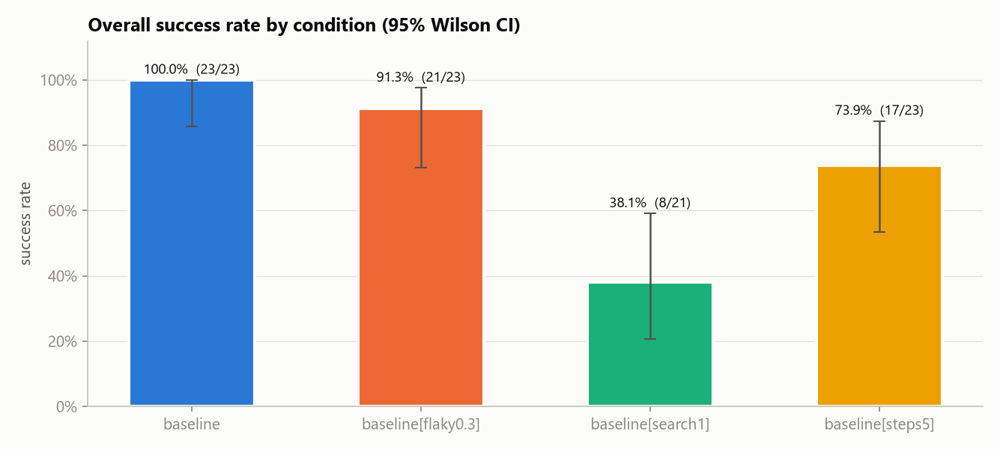
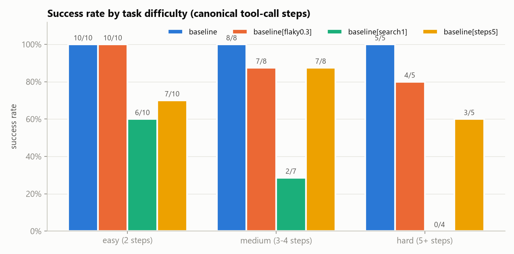
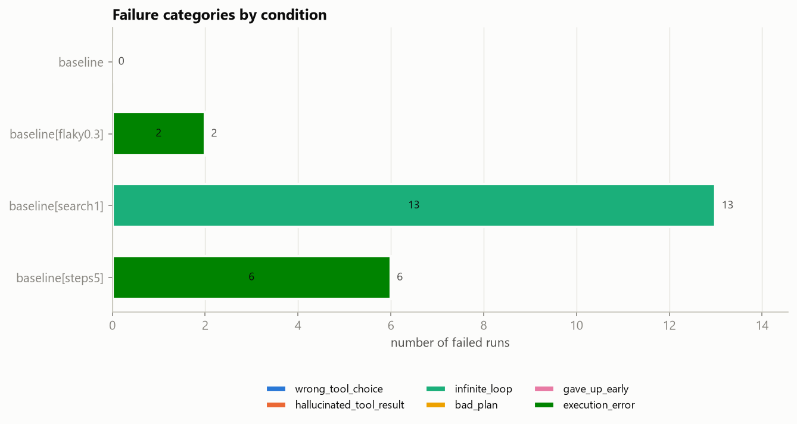
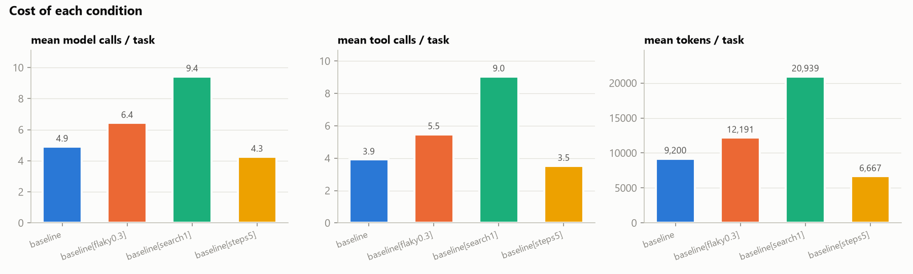
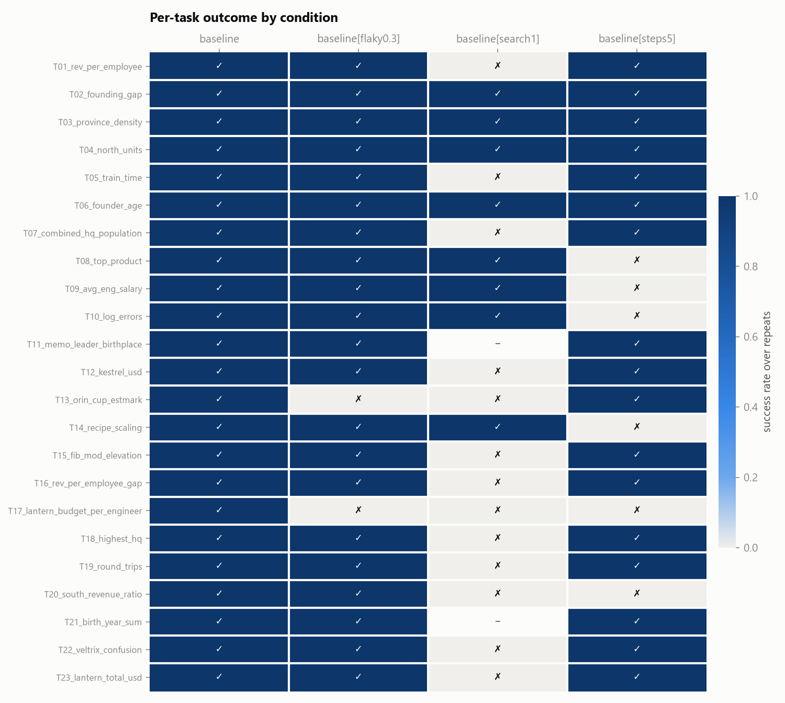

# Agent reliability report

- Model(s): gemma-4-26b-a4b-it
- Tasks: 23
- Run directories: gemma26_baseline, stress26_steps5, stress26_flaky30, stress26_search1
- Every number below was computed from the run traces. Runs that ended in `api_error` are excluded from success rates and counted separately.

## Overall success

| condition | scored runs | correct | success | 95% CI | api_error (excluded) |
|---|---|---|---|---|---|
| baseline | 23 | 23 | 100.0% | 85.7% – 100.0% | 0 |
| baseline[flaky0.3] | 23 | 21 | 91.3% | 73.2% – 97.6% | 0 |
| baseline[search1] | 21 | 8 | 38.1% | 20.8% – 59.1% | 2 |
| baseline[steps5] | 23 | 17 | 73.9% | 53.5% – 87.5% | 0 |

## Success by difficulty

| difficulty | baseline | baseline[flaky0.3] | baseline[search1] | baseline[steps5] |
|---|---|---|---|---|
| easy (2 steps) | 100.0% (10/10) | 100.0% (10/10) | 60.0% (6/10) | 70.0% (7/10) |
| medium (3-4 steps) | 100.0% (8/8) | 87.5% (7/8) | 28.6% (2/7) | 87.5% (7/8) |
| hard (5+ steps) | 100.0% (5/5) | 80.0% (4/5) | 0.0% (0/4) | 60.0% (3/5) |

## Failure categories

Final category = manual label when present, otherwise the heuristic label.

| category | baseline | baseline[flaky0.3] | baseline[search1] | baseline[steps5] |
|---|---|---|---|---|
| wrong_tool_choice | 0 | 0 | 0 | 0 |
| hallucinated_tool_result | 0 | 0 | 0 | 0 |
| infinite_loop | 0 | 0 | 13 | 0 |
| bad_plan | 0 | 0 | 0 | 0 |
| gave_up_early | 0 | 0 | 0 | 0 |
| execution_error | 0 | 2 | 0 | 6 |

_No manual labels yet. Categories are heuristic only (run `label` to review them)._

## Interventions vs baseline

Paired by task (majority outcome over repeats). *fixed* = baseline wrong → intervention right; *broken* = the reverse. p = exact McNemar test on fixed vs broken. With this few tasks, treat p > 0.05 as "no detectable effect", not as evidence of no effect.

| condition | paired tasks | baseline | condition | Δ | fixed | broken | McNemar p |
|---|---|---|---|---|---|---|---|
| baseline[flaky0.3] | 23 | 100.0% | 91.3% | -8.7 pp | 0 | 2 | 0.500 |
| baseline[search1] | 21 | 100.0% | 38.1% | -61.9 pp | 0 | 13 | 0.000 |
| baseline[steps5] | 23 | 100.0% | 73.9% | -26.1 pp | 0 | 6 | 0.031 |

- **baseline[flaky0.3]**: fixed —; broken ['T13_orin_cup_estmark', 'T17_lantern_budget_per_engineer']
- **baseline[search1]**: fixed —; broken ['T01_rev_per_employee', 'T05_train_time', 'T07_combined_hq_population', 'T12_kestrel_usd', 'T13_orin_cup_estmark', 'T15_fib_mod_elevation', 'T16_rev_per_employee_gap', 'T17_lantern_budget_per_engineer', 'T18_highest_hq', 'T19_round_trips', 'T20_south_revenue_ratio', 'T22_veltrix_confusion', 'T23_lantern_total_usd']
- **baseline[steps5]**: fixed —; broken ['T08_top_product', 'T09_avg_eng_salary', 'T10_log_errors', 'T14_recipe_scaling', 'T17_lantern_budget_per_engineer', 'T20_south_revenue_ratio']

## Cost and intervention delivery

*self-checks answered* = self-check prompts the model responded to, out of prompts sent. If it's below the total, the model silently skipped verification (empty reply), and that condition does not really test self-check. *seconds* includes rate-limit and retry waits.

| condition | model calls | tool calls | tool errors | tokens | seconds | API retries (total) | empty responses | self-checks answered |
|---|---|---|---|---|---|---|---|---|
| baseline | 4.9 | 3.9 | 0.35 | 9,200 | 44.3 | 3 | 0 | 0/0 |
| baseline[flaky0.3] | 6.4 | 5.5 | 1.96 | 12,191 | 64.8 | 10 | 1 | 0/0 |
| baseline[search1] | 9.4 | 9.0 | 0.33 | 20,939 | 95.8 | 14 | 0 | 0/0 |
| baseline[steps5] | 4.3 | 3.5 | 0.30 | 6,667 | 63.1 | 3 | 0 | 0/0 |

## Per-task outcomes

| task | steps | baseline | baseline[flaky0.3] | baseline[search1] | baseline[steps5] |
|---|---|---|---|---|---|
| T01_rev_per_employee | 2 | 1/1 | 1/1 | 0/1 (infinite_loop) | 1/1 |
| T02_founding_gap | 2 | 1/1 | 1/1 | 1/1 | 1/1 |
| T03_province_density | 2 | 1/1 | 1/1 | 1/1 | 1/1 |
| T04_north_units | 2 | 1/1 | 1/1 | 1/1 | 1/1 |
| T05_train_time | 2 | 1/1 | 1/1 | 0/1 (infinite_loop) | 1/1 |
| T06_founder_age | 3 | 1/1 | 1/1 | 1/1 | 1/1 |
| T07_combined_hq_population | 5 | 1/1 | 1/1 | 0/1 (infinite_loop) | 1/1 |
| T08_top_product | 2 | 1/1 | 1/1 | 1/1 | 0/1 (execution_error) |
| T09_avg_eng_salary | 2 | 1/1 | 1/1 | 1/1 | 0/1 (execution_error) |
| T10_log_errors | 2 | 1/1 | 1/1 | 1/1 | 0/1 (execution_error) |
| T11_memo_leader_birthplace | 3 | 1/1 | 1/1 | – | 1/1 |
| T12_kestrel_usd | 3 | 1/1 | 1/1 | 0/1 (infinite_loop) | 1/1 |
| T13_orin_cup_estmark | 4 | 1/1 | 0/1 (execution_error) | 0/1 (infinite_loop) | 1/1 |
| T14_recipe_scaling | 4 | 1/1 | 1/1 | 1/1 | 0/1 (execution_error) |
| T15_fib_mod_elevation | 2 | 1/1 | 1/1 | 0/1 (infinite_loop) | 1/1 |
| T16_rev_per_employee_gap | 3 | 1/1 | 1/1 | 0/1 (infinite_loop) | 1/1 |
| T17_lantern_budget_per_engineer | 5 | 1/1 | 0/1 (execution_error) | 0/1 (infinite_loop) | 0/1 (execution_error) |
| T18_highest_hq | 6 | 1/1 | 1/1 | 0/1 (infinite_loop) | 1/1 |
| T19_round_trips | 3 | 1/1 | 1/1 | 0/1 (infinite_loop) | 1/1 |
| T20_south_revenue_ratio | 5 | 1/1 | 1/1 | 0/1 (infinite_loop) | 0/1 (execution_error) |
| T21_birth_year_sum | 7 | 1/1 | 1/1 | – | 1/1 |
| T22_veltrix_confusion | 2 | 1/1 | 1/1 | 0/1 (infinite_loop) | 1/1 |
| T23_lantern_total_usd | 3 | 1/1 | 1/1 | 0/1 (infinite_loop) | 1/1 |
